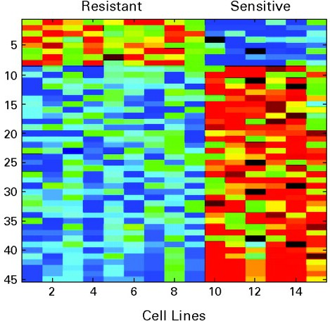

```{r style, echo = FALSE, results = 'asis'}
BiocStyle::markdown()
options(width=100, max.print=1000)
knitr::opts_chunk$set(
    eval=as.logical(Sys.getenv("KNITR_EVAL", "TRUE")),
    cache=as.logical(Sys.getenv("KNITR_CACHE", "TRUE")))
```

```{r setup, echo=FALSE, messages=FALSE, warnings=FALSE}
suppressPackageStartupMessages({
    library(airway)
    library(DESeq2)
    library(ggplot2)
    library(org.Hs.eg.db)
})
```

The material in this course requires R version 3.2 and Bioconductor
version 3.2

```{r configure-test}
stopifnot(
    getRversion() >= '3.2' && getRversion() < '3.3',
    BiocInstaller::biocVersion() == "3.2"
)
```

# What is _Bioconductor_?

Physically

- Collection of 1024 R packages.
- Web site (http://bioconductor.org) for package distribution and
  other resources.
- Support site (https://support.bioconductor.org) for user questions.

Conceptually

- Analysis and comprehension of high throughput genomic data

# Core principles

## High-throughput analysis needs statistics!

Volume of data

Type of research question

- Designed experiments
- Population samples
- ...

Technological artifacts

- Differences in sequencing depth between samples
- Bias in the genomic regions sampled

## Scientific research needs to be reproducible

### A motivating case study

- Cisplatin-resistant non-small-cell lung cancer gene sets

- Hsu et al. 2007 J Clin Oncol 25:
  [4350-4357](http://jco.ascopubs.org/content/25/28/4350.abstract)
  [retracted](http://jco.ascopubs.org/content/28/35/5229.long)

  

- Baggerly & Coombes 2009 Ann Appl Stat
  [3: 1309-1334](http://projecteuclid.org/DPubS?service=UI&version=1.0&verb=Display&handle=euclid.aoas/1267453942)

  

Lessons

- Record each step of the analysis
- Coordinated manipulation of feature, sample, and assay data
- Informative labels on visualizations

### How to be reproducible?

- Use software 'objects' that take care of some of the tedious
  book-keeping
- Document our analysis in scripts and 'markdown' documents

### Example: `SummarizedExperiment`


Underlying data is a matrix

- Regions of interest (e.g., genes) x samples
- `assay()` -- e.g., matrix of counts of reads overlapping genes

Include information about rows

- `rowRanges()` -- gene identifiers, or _genomic ranges_ describing
  the coordinates of each gene

Include information about columns

- `colData()` -- describing samples, experimental design, ...

```{r airway-SummarizedExperiment}
library(airway)         # An 'ExperimentData' package...
data(airway)            # ...with a sample data set...
airway                  # ...that is a SummarizedExperiment
head(assay(airway))     # contains a matrix of counts
head(rowRanges(airway)) # information about the genes...
colData(airway)[, 1:3]  # ...and samples
## coordinated subsetting
untrt <- airway[, airway$dex == 'untrt']
head(assay(untrt))
colData(untrt)[, 1:3]
```

## We can 'stand on the shoulders of giants'

Packages!

- [biocViews](http://bioconductor.org/packages/)
- Vignettes
- Workflows
- Course material and tutorials

## We should explore our data

Visualization

Inter-operability between packages

- Made easier by using similar data structures

Examples (details later)

- `SummarizedExperiment`
- `DNAStringSet`
- `GenomicRanges`

## Comprehension is more than statistical analysis

Annotation

- Mapping from technical to user-friendly identifiers
- Assigning genes to pathways
- Placing our results in the context of large-scale analyses

Case studies

- e.g., [airway][]!

# _Bioconductor_'s role in sequence analysis

## Overall work flow

### General steps

1. Experimental design

   - Keep it simple!
   - Replication!
   - Avoid or track batch effects

2. Wet-lab preparation

3. High-throughput sequencing

   - Output: FASTQ files of reads and their quality scores

        @ERR127302.1703 HWI-EAS350_0441:1:1:1460:19184#0/1
        CCTGAGTGAAGCTGATCTTGATCTACGAAGAGAGATAGATCTTGATCGTCGAGGAGATGCTGACCTTGACCT
        +
        HHGHHGHHHHHHHHDGG<GDGGE@GDGGD<?B8??ADAD<BE@EE8EGDGA3CB85*,77@>>CE?=896=:
        @ERR127302.1704 HWI-EAS350_0441:1:1:1460:16861#0/1
        GCGGTATGCTGGAAGGTGCTCGAATGGAGAGCGCCAGCGCCCCGGCGCTGAGCCGCAGCCTCAGGTCCGCCC
        +
        DE?DD>ED4>EEE>DE8EEEDE8B?EB<@3;BA79?,881B?@73;1?########################
        
4. Alignment

   - Many different aligners, some specialized for different purposes
   - Output: BAM files of aligned reads

        ERR127306.7941162       403     chr14   19653689        3       72M             =       19652348        -1413  ...
        ERR127306.22648137      145     chr14   19653692        1       72M             =       19650044        -3720  ...

        ... GAATTGATCAGTCTCATCTGAGAGTAACTTTGTACCCATCACTGATTCCTTCTGAGACTGCCTCCACTTCCC        *'%%%%%#&&%''#'&%%%)&&%%$%%'%%'&*****$))$)'')'%)))&)%%%%$'%%%%&"))'')%))
        ... TTGATCAGTCTCATCTGAGAGTAACTTTGTACCCATCACTGATTCCTTCTGAGACTGCCTCCACTTCCCCAG        '**)****)*'*&*********('&)****&***(**')))())%)))&)))*')&***********)****

        ... AS:i:0  XN:i:0  XM:i:0  XO:i:0  XG:i:0  NM:i:0  MD:Z:72 YT:Z:UU NH:i:2  CC:Z:chr22      CP:i:16189276   HI:i:0
        ... AS:i:0  XN:i:0  XM:i:0  XO:i:0  XG:i:0  NM:i:0  MD:Z:72 YT:Z:UU NH:i:3  CC:Z:=  CP:i:19921600   HI:i:0


5. Summary

   - e.g., RNA-Seq: _count_ of reads overlapping regions of interest
     (e.g., genes)
   - e.g., ChIP-Seq: _ranges_ where regulatory elements bind
   - Output: '.csv', BED, or WIG files

6. Statistical analysis

7. Comprehension

### An example: RNA-Seq differential expression of known genes

More detail later!

Example: 'airway' data set used in a later lab

- Airway smooth muscle cells treated with dexamethasone, a synthetic
  glucocorticoid steroid with anti-inflammatory
  effects. Glucocorticoids are used in asthma patients to prevent or
  reduce inflammation of the airways. 
- Four primary human airway smooth muscle cell lines
- Each cell line: a control sample and a treated sample. Treatment: 1
  micromolar dexamethasone for 18 hours.
- Himes BE, Jiang X, Wagner P, Hu R, Wang Q, Klanderman B, Whitaker
  RM, Duan Q, Lasky-Su J, Nikolos C, Jester W, Johnson M, Panettieri R
  Jr, Tantisira KG, Weiss ST, Lu Q. "RNA-Seq Transcriptome Profiling
  Identifies CRISPLD2 as a Glucocorticoid Responsive Gene that
  Modulates Cytokine Function in Airway Smooth Muscle Cells." PLoS
  One. 2014 Jun 13;9(6):e99625.  PMID:
  [24926665](http://www.ncbi.nlm.nih.gov/pubmed/24926665).  GEO:
  [GSE52778](http://www.ncbi.nlm.nih.gov/geo/query/acc.cgi?acc=GSE52778).

Steps

1. Experimental design

   - One covariate: cell line
   - One experimental factor with two levels: control, and treated
     with dexamethasone

    ```{r airway-colData}
    library(airway)         # An 'ExperimentData' package...
    data(airway)            # ...with a sample data set...
    colData(airway)[, 1:3]  # ...represented as a SummarizedExperiment
    ```

2. Wet-lab preparation

3. High-throughput sequencing

   - Paired-end reads
   - Output: FASTQ files

4. Alignment

   - [STAR](https://code.google.com/p/rna-star/) aligner
   - Aligned to Ensembl release 75 of the human reference genome
   - Output: BAM files

5. Summarization

   - `GenomicRanges::summarizeOverlaps()`
   - Output: matrix of the _count_ of reads overlapping regions of
     interest. Each row is a gene. Each column is a sample.
     
    ```{r airway-assay}
    head(assay(airway))
    ```

6. Statistical analysis

   - Test each gene for statistical difference between control and
     treatement group
   - Output: _top table_ of differentially expressed genes. For each
     gene: 'log fold change' describing how large a change occurred,
     and a test statistic (e.g., adjusted p-value) summarizing
     statistical evidence for the change

    ```{r airway-toptable}
    library(DESeq2)     # package implementing statistical methods
    dds <-              # data and experimental design
        DESeqDataSet(airway, design = ~ cell + dex)
    dds <- DESeq(dds)   # initial analysis
    res <- results(dds) # summary results
    ridx <-             # order from largest to smallest absolute log fold change
        order(abs(res$log2FoldChange), decreasing=TRUE)
    res <- res[ridx,]
    head(res)           # top-table
    ```

7. Comprehension

   - Visualization

    ```{r airway-viz}
    library(ggplot2)
    ggplot(as.data.frame(res), 
           aes(x=log2FoldChange, y=-10 * log10(pvalue))) +
        geom_point()
    ```

   - From Ensembl gene identifiers to gene symbols, pathways, ...
   
    ```{r airway-mapids}
    library(org.Hs.eg.db)
    ensid <- head(rownames(res))
    select(org.Hs.eg.db, ensid, c("SYMBOL", "GENENAME"), "ENSEMBL")
    ```

## Bioinformatic steps and _Bioconductor_ packages


## Two _shiny_ examples

BAMSpector -- display gene models and underlying support across BAM
(aligned read) files

```{r shiny-BAMSpector, eval=FALSE}
app <- system.file(package="BiocUruguay2015", "BAMSpector")
shiny::runApp(app)
```

MAPlotExplorer -- summarize two-group differential expression,
including drill-down of individual genes. Based on [CSAMA
2015](http://github.com/CSAMA2015/materials/labs/4_Thursday/Interactive_data_visualization_with_Shiny/)
lab by Andrzej Oles.

```{r shiny-MAPlotExplorer, eval=FALSE}
app <- system.file(package="BiocUruguay2015", "MAPlotExplorer")
shiny::runApp(app)
```

Some uses illustrated by these applications

- Working with large data -- [GenomicAlignments][], [GenomicFiles][]
- Identifier mapping -- [AnnotationDbi][]
- Representing gene structure -- [GenomicFeatures][]
- Annotation resources -- [org.Hs.eg.db][],
  [TxDb.Hsapiens.UCSC.hg19.knownGene][], [AnnotationHub][]
- Statistical analysis of differential expression -- [DESeq2][]
- Experiment data packages -- [RNAseqData.HNRNPC.bam.chr14][],
  [airway][]
- Visualization -- [Gviz][], [shiny][]

# Resources

Acknowledgements

- Core (Seattle): Sonali Arora, Marc Carlson, Nate Hayden, Jim Hester,
  Valerie Obenchain, Herv&eacute; Pag&egrave;s, Paul Shannon, Dan
  Tenenbaum.

- The research reported in this presentation was supported by the
  National Cancer Institute and the National Human Genome Research
  Institute of the National Institutes of Health under Award numbers
  U24CA180996 and U41HG004059, and the National Science Foundation
  under Award number 1247813. The content is solely the responsibility
  of the authors and does not necessarily represent the official views
  of the National Institutes of Health or the National Science
  Foundation.

## Key references

- Irizarry R, et al. (2015) <a
  href="http://genomicsclass.github.io/book/">Biomedical Data
  Science</a>. Course Notes, EdX PH525.1x.
- Huber W, et al. (2015) <a
  href="http://www.nature.com/nmeth/journal/v12/n2/abs/nmeth.3252.html">Orchestrating
  high-throughput genomic analysis with
  <em>Bioconductor</em></a>. Nature Methods 12:115-121;
  doi:10.1038/nmeth.3252 (full-text free with registration).
- Lawrence M, Huber W, Pag&egraves;s H, Aboyoun P, Carlson M, et al. (2013) <a
  href="https://doi.org/10.1371/journal.pcbi.1003118">Software for
  Computing and Annotating Genomic Ranges</a>. PLoS Comput Biol 9(8):
  e1003118. doi: 10.1371/journal.pcbi.1003118

## `sessionInfo()`

```{r sessionInfo}
sessionInfo()
```

[GenomicAlignments]: http://bioconductor.org/packages/GenomicAlignments
[GenomicFiles]: http://bioconductor.org/packages/GenomicFiles
[AnnotationDbi]: http://bioconductor.org/packages/AnnotationDbi
[GenomicFeatures]: http://bioconductor.org/packages/GenomicFeatures
[org.Hs.eg.db]: http://bioconductor.org/packages/org.Hs.eg.db
[TxDb.Hsapiens.UCSC.hg19.knownGene]: http://bioconductor.org/packages/TxDb.Hsapiens.UCSC.hg19.knownGene
[AnnotationHub]: http://bioconductor.org/packages/AnnotationHub
[DESeq2]: http://bioconductor.org/packages/DESeq2
[RNAseqData.HNRNPC.bam.chr14]: http://bioconductor.org/packages/RNAseqData.HNRNPC.bam.chr14
[airway]: http://bioconductor.org/packages/airway
[Gviz]: http://bioconductor.org/packages/Gviz
[shiny]: http://bioconductor.org/packages/shiny
