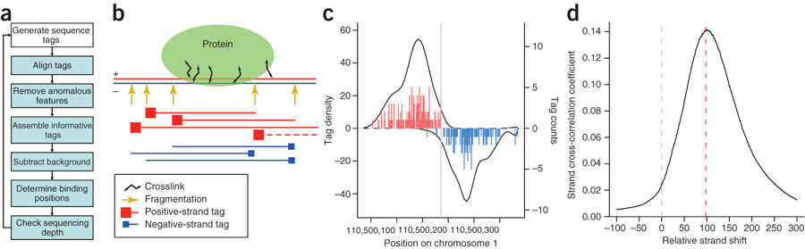
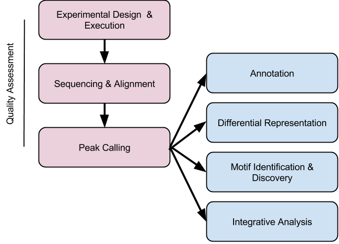

```{r style, echo = FALSE, results = 'asis'}
BiocStyle::markdown()
options(width=100, max.print=1000)
knitr::opts_chunk$set(
    eval=as.logical(Sys.getenv("KNITR_EVAL", "TRUE")),
    cache=as.logical(Sys.getenv("KNITR_CACHE", "TRUE")))
```

```{r setup, echo=FALSE, messages=FALSE, warnings=FALSE}
suppressPackageStartupMessages({
    library(csaw)
    library(edgeR)
    library(GenomicRanges)
    library(ChIPseeker)
    library(genefilter)
    library(TxDb.Hsapiens.UCSC.hg19.knownGene)
    library(org.Hs.eg.db)
    library(clusterProfiler)
})
```

The material in this course requires R version 3.2 and Bioconductor
version 3.2

```{r configure-test}
stopifnot(
    getRversion() >= '3.2' && getRversion() < '3.3',
    BiocInstaller::biocVersion() == "3.2"
)
```
# Motivation & work flow

Key references

- Kharchenko, Tolstorukov, and Park
  ([2008](http://www.ncbi.nlm.nih.gov/pmc/articles/PMC2597701/)).
- Lun and Smyth ([2014](https://doi.org/10.1093/nar/gku351)).

## ChIP-seq

Lun, [BioC 2015](http://bioconductor.org/help/course-materials/2015/BioC2015/csaw_lab.html)


Kharchenko et
al. ([2008](http://www.ncbi.nlm.nih.gov/pmc/articles/PMC2597701/)).


- Tags versus sequenced reads; single-end read extension in 3'
  direction
- Strand shift / cross-correlation
- Defined (narrow, e.g., transcription factor binding sites) versus
  diffuse (e.g., histone marks) peaks

ChIP-seq for differential binding

- Designed experiment with replicate samples per treatment
- Analysis using insights from microarrays / RNA-seq

Novel statistical issues

- Inferring peaks without 'data snooping' (using the same data twice,
  once to infer peaks, once to estimate differential binding)
- Retaining power
- Minimizing false discovery rate

## Work flow

- Following Bailey et al.,
  [2013](https://doi.org/10.1371/journal.pcbi.1003326)



Experimental design and execution

- Single sample

    - ChIPed transcription factor and\ldots
    - Input (fragmented genomic DNA) or control (e.g., IP with
      non-specific antibody such as immunoglobulin G, IgG)

- Designed experiments

    - Replication of TF / control pairs

Sequencing & alignment

- Sequencing depth rules of thumb: $>10M$ reads for narrow peaks,
  $>20M$ for broad peaks
- Long & paired end useful but not essential -- alignment in ambiguous
  regions
- Basic aligners generally adequate, e.g., no need to align splice
  junctions
- Sims et al., [2014](https://doi.org/10.1038/nrg3642)

Peak calling

- Very large number of peak calling programs; some specialized for
  e.g., narrow vs. broad peaks.
- Commmonly used: [MACS](http://liulab.dfci.harvard.edu/MACS/),
  PeakSeq, CisGenome, ...
- MACS: Model-based Analysis for ChIP-Seq, Liu et al.,
  [2008](https://doi.org/10.1186/gb-2008-9-9-r137)

    - Scale control tag counts to match ChIP counts
    - Center peaks by shifting $d/2$
    - Model occurrence of a tag as a Poisson process
    - Look for fixed width sliding windows with exceess number of tag
      enrichment
    - Empirical FDR: Swap ChIP and control samples; FDR is \# control
      peaks / \# ChIP peaks
    - Output: BED file of called peaks

Down-stream analysis

- Annotation: what genes are my peaks near?
- Differential representation: which peaks are over- or
  under-represented in treatment 1, compared to treatment 2?
- Motif identification (peaks over known motifs?)  and discovery
- Integrative analysis, e.g., assoication of regulatory elements and
  expression

## Peak calling

'Known' ranges

- Count tags in pre-defined ranges, e.g., promoter regions of known
  genes
- Obvious limitations, e.g., regulatory elements not in specified
  ranges; specified range contains multiple regulatory elements with
  complementary behavior

_de novo_ windows

- Width: narrow peaks, 1bp; broad peaks, 150bp
- Offset: 25-100bp; influencing computational burden

_de novo_ peak calling

- Third-party software (many available;
  [MACS](http://liulab.dfci.harvard.edu/MACS/) commonly used)
- Various strategies for calling peaks -- Lun & Smyth,
  [Table 1](http://nar.oxfordjournals.org/content/42/11/e95/T1.expansion.html)

    - Call each sample independently; intersection or union of peaks
      across samples, ...
    - Call peaks from a pooled library
    - ...

- Relevant slides [pdf](http://bioconductor.org/help/course-materials/2014/CSAMA2014/4_Thursday/lectures/ChIPSeq_slides.pdf)

## Peak calling across libraries

- <em>Table 1</em>: Description of peak calling strategies. Each
  strategy is given an identifier and is described by the mode in
  which MACS is run, the libraries on which it is run and the
  consolidation operation (if any) performed to combine peaks between
  libraries or groups. For method 6, the union of the peaks in each
  direction of enrichment is taken.

<table frame="hsides" id="table-1">
<thead id="thead-1">
<tr id="tr-1">
<th align="left" rowspan="1" colspan="1" id="th-1" class="table-left">ID</th>
<th align="left" rowspan="1" colspan="1" id="th-2" class="table-left">Mode</th>
<th align="left" rowspan="1" colspan="1" id="th-3" class="table-left">Library</th>
<th align="left" rowspan="1" colspan="1" id="th-4" class="table-left">Operation</th>
</tr>
</thead>
<tbody id="tbody-1">
<tr id="tr-2">
<td id="td-1">1</td>
<td id="td-2">Single-sample</td>
<td id="td-3">Individual</td>
<td id="td-4">Union</td>
</tr>
<tr id="tr-3">
<td id="td-5">2</td>
<td id="td-6">Single-sample</td>
<td id="td-7">Individual</td>
<td id="td-8">Intersection</td>
</tr>
<tr id="tr-4">
<td id="td-9">3</td>
<td id="td-10">Single-sample</td>
<td id="td-11">Individual</td>
<td id="td-12">At least 2</td>
</tr>
<tr id="tr-5">
<td id="td-13">4</td>
<td id="td-14">Single-sample</td>
<td id="td-15">Pooled over group</td>
<td id="td-16">Union</td>
</tr>
<tr id="tr-6">
<td id="td-17">5</td>
<td id="td-18">Single-sample</td>
<td id="td-19">Pooled over group</td>
<td id="td-20">Intersection</td>
</tr>
<tr id="tr-7">
<td id="td-21">6</td>
<td id="td-22">Two-sample</td>
<td id="td-23">Pooled over group</td>
<td id="td-24">Union</td>
</tr>
<tr id="tr-8">
<td id="td-25">7</td>
<td id="td-26">Single-sample</td>
<td id="td-27">Pooled over all</td>
<td id="td-28">-</td>
</tr>
</tbody>
</table>

- How to choose? -- Lun & Smyth,
  
    - Under the null hypothesis, type I error rate is uniform

        ```{r null-p, cache=TRUE}
        ## 100,000 t-tests under the null, n = 6
        n <- 6; m <- matrix(rnorm(n * 100000), ncol=n)
        P <- genefilter::rowttests(m, factor(rep(1:2, each=3)))$p.value
        quantile(P, c(.001, .01, .05))
        hist(P, breaks=20)
        ```

    - [Table 2](http://nar.oxfordjournals.org/content/42/11/e95/T2.expansion.html):
      consequences for type I error
    - Best strategy: call peaks from a pooled library
    - <em>Table 2</em>: The observed type I error rate when testing
      for differential enrichment using counts from each peak calling
      strategy. Error rates for a range of specified error thresholds
      are shown. All values represent the mean of 10 simulation
      iterations with the standard error shown in brackets. RA:
      reference analysis using 10 000 randomly chosen true peaks.
                   
<table frame="hsides" id="table-2">
<thead id="thead-2">
<tr id="tr-9">
<th align="left" rowspan="1" colspan="1" id="th-5" class="table-left">ID</th>
<th colspan="3" align="center" rowspan="1" id="th-6" class="table-center 1">Error rate</th>
</tr>
<tr id="tr-10">
<th align="left" rowspan="1" colspan="1" id="th-7" class="table-left">&nbsp;</th>
<th align="left" rowspan="1" colspan="1" id="th-8" class="table-left">0.01</th>
<th align="left" rowspan="1" colspan="1" id="th-9" class="table-left">0.05</th>
<th align="left" rowspan="1" colspan="1" id="th-10" class="table-left">0.1</th>
</tr>
</thead>
<tbody id="tbody-2">
<tr id="tr-11">
<td id="td-29">RA</td>
<td id="td-30">0.010 (0.000)</td>
<td id="td-31">0.051 (0.001)</td>
<td id="td-32">0.100 (0.002)</td>
</tr>
<tr id="tr-12">
<td id="td-33">1</td>
<td id="td-34">0.002 (0.000)</td>
<td id="td-35">0.019 (0.001)</td>
<td id="td-36">0.053 (0.001)</td>
</tr>
<tr id="tr-13">
<td id="td-37">2</td>
<td id="td-38">0.003 (0.000)</td>
<td id="td-39">0.030 (0.000)</td>
<td id="td-40">0.073 (0.001)</td>
</tr>
<tr id="tr-14">
<td id="td-41">3</td>
<td id="td-42">0.006 (0.000)</td>
<td id="td-43">0.042 (0.001)</td>
<td id="td-44">0.092 (0.001)</td>
</tr>
<tr id="tr-15">
<td id="td-45">4</td>
<td id="td-46">0.033 (0.001)</td>
<td id="td-47">0.145 (0.001)</td>
<td id="td-48">0.261 (0.002)</td>
</tr>
<tr id="tr-16">
<td id="td-49">5</td>
<td id="td-50">0.000 (0.000)</td>
<td id="td-51">0.001 (0.000)</td>
<td id="td-52">0.005 (0.000)</td>
</tr>
<tr id="tr-17">
<td id="td-53">6</td>
<td id="td-54">0.088 (0.006)</td>
<td id="td-55">0.528 (0.013)</td>
<td id="td-56">0.893 (0.006)</td>
</tr>
<tr id="tr-18">
<td id="td-57">7</td>
<td id="td-58">0.010 (0.000)</td>
<td id="td-59">0.049 (0.001)</td>
<td id="td-60">0.098 (0.001)</td>
</tr>
</tbody>
</table>
   
# Practical: Peak summary and annotation (`r Biocpkg("ChIPseeker")`)

The
[`ChIPseeker` vignette](http://bioconductor.org/packages/devel/bioc/vignettes/ChIPseeker/inst/doc/ChIPseeker.html)
is an excellent resource, and we'll walk through parts of it for our
lab.

```{r, eval=FALSE}
vignette("ChIPseeker")
```

# Practical: Differential binding (`r Biocpkg("csaw")`)

This exercise is based on the `r Biocpkg("csaw")` vignette, where more
detail can be found. This is innovative in two ways: (1) it doesn't
call 'peaks', but is instead based on analysis of _windows_ that span
the entire genome; and (2) it emphasizes comparison of ChIP patterns
across samples, looking for _differential binding_ between treatment
groups.

Start by downloading [csaw-data.Rds][] and [csaw-normfacs.Rds][]

## 1 - 4: Experimental Design ... Alignment

The experiment involves changes in binding profiles of the NFYA
protein between embryonic stem cells and terminal neurons. It is a
subset of the data provided by Tiwari et
al. [2012](https://doi.org/10.1038/ng.1036) available as
[GSE25532](http://www.ncbi.nlm.nih.gov/geo/query/acc.cgi?acc=GSE25532). There
are two es (embryonic stem cell) and two tn (terminal neuron)
replicates. Single-end FASTQ files were extracted from GEO, aligned
using `r Biocpkg("Rsubread")`, and post-processed (sorted and indexed)
using `r Biocpkg("Rsamtools")` with this script:

```
## SystemRequirements: ascp; fastq-dump

source("setup.R")
library(SRAdb)
library(Rsubread)
library(Rsamtools)
library(BiocParallel)

sradb <- "SRAmetadb.sqlite"
key <- "/app/aspera-connect/3.1.1/etc/asperaweb_id_dsa.openssh"
cmd = sprintf("ascp -TT -l300m -i %s", key)
source("setup.R")

if (!file.exists(sradb))
    getSRAdbFile()
con = dbConnect(dbDriver("SQLite"), sradb)

accs <- rownames(files)[!file.exists(files$sra)]
for (acc in accs)
    sraFiles = ascpSRA(acc, con, cmd, fileType="sra", destDir=getwd())

sras <- files$sra[!file.exists(files$fastq)]
bplapply(sras, function(sra) system(sprintf("fastq-dump --gzip %s", sra)))


fastqs <- files$fastq[!file.exists(files$bam)]
if (length(fastqs))
    Rsubread::align("../mm10/mm10.Rsubread.index", fastqs,
                    nthreads=parallel::detectCores() / 2L)

bams <- files$bam[!file.exists(sprintf("%s.bai", files$bam))]
bams_sorted <- sub(".BAM", ".sorted.bam", bams)
sorted <- bpmapply(sortBam, bams, bams_sorted)
## oops! didn't mean to do the next line
file.rename(sorted, names(sorted))
bplapply(sorted, indexBam)    

```

This generates 4 BAM files, one per sample. The BAM files are about 2
GB each. The files are summarized by the following data frame:

```{r csaw-setup}
files <- local({
    acc <- c(es_1="SRR074398", es_2="SRR074399", tn_1="SRR074417",
             tn_2="SRR074418")
    data.frame(Treatment=sub("_.*", "", names(acc)),
               Replicate=sub(".*_", "", names(acc)),
               sra=sprintf("%s.sra", acc),
               fastq=sprintf("%s.fastq.gz", acc),
               bam=sprintf("%s.fastq.gz.subread.BAM", acc),
               row.names=acc, stringsAsFactors=FALSE)
})
```

## 5: Reduction

To process the data, I'll change to the directory where the BAM files
are located at

```{r csaw-setwd, eval=FALSE}
setwd("~/UseBioconductor-data/ChIPSeq/NFYA")
```

...and then load the csaw library and count reads in overlapping
windows. 

```{r csaw-reduction, eval=FALSE}
library(csaw)
library(GenomicRanges)
frag.len <- 110
system.time({
    data <- windowCounts(files$bam, width=10, ext=frag.len)
})                                      # 156 seconds
acc <- sub(".fastq.*", "", data$bam.files)
colData(data) <- cbind(files[acc,], colData(data))
```

Load this data into your own _R_ session with the following command:

```{r load-csaw}
data <- readRDS("csaw-data.Rds")
```

`data` is a `SummarizedExperiment`, so explore it a bit...

## 6: Analysis

**Filtering** (vignette Chapter 3) Start by filtering low-count
windows. There are likely to be many of these (how many?). Is there a
rational way to choose the filtering threshold?

```{r csaw-filter}
library(edgeR)     # for aveLogCPM()
keep <- aveLogCPM(assay(data)) >= -1
data <- data[keep,]
```

**Normalization (composition bias)** (vignette Chapter 4) csaw uses
binned counts in normalization. The bins are large relative to the
ChIP peaks, on the assumption that the bins primarily represent
non-differentially bound regions. The sample bin counts are normalized
using the `r Biocpkg("edgeR")` TMM (trimmed median of M values) method
seen in the RNASeq differential expression lab. Explore vignette
chapter 4 for more on normalization (this is a useful resource when
seeking to develop normalization methods for other protocols!).

This requires access to the big data, so we don't run the following
code

```{r csaw-normalize, eval=FALSE}
system.time({
    binned <- windowCounts(files$bam, bin=TRUE, width=10000)
})                                      #139 second
normfacs <- normalize(binned)
```

...but instead load the summary into our session

```{r csaw-normacs-load}
normfacs <- readRDS("csaw-normfacs.Rds")
```

**Experimental design and Differential binding** (vignette Chapter 5)
Differential binding will be assessed using `r Biocpkg("edgeR")`,
where we need to specify the experimental design

```{r csaw-experimental-design}
design <- model.matrix(~Treatment, colData(data))
```

Apply a standard `r Biocpkg("edgeR")` work flow to identify
differentially bound regions. Creatively explore the results.

```{r csaw-de}
y <- asDGEList(data, norm.factors=normfacs)
y <- estimateDisp(y, design)
fit <- glmQLFit(y, design, robust=TRUE)
results <- glmQLFTest(fit, contrast=c(0, 1))
head(results$table)
```

**Multiple testing** (vignette Chapter 6) The challenge is that FDR
across all detected differentially bound _regions_ is what one is
interested in, but what is immediately available is the FDR across
differentially bound _windows_; region will often consist of multiple
overlapping windows. As a first step, we'll take a 'quick and dirty'
approach to identifying regions by merging 'high-abundance' windows
that are within, e.g., 1kb of one another

```{r csaw-merge-windows}
merged <- mergeWindows(rowRanges(data), tol=1000L)
```

Combine test results across windows within regions. Several strategies
are explored in section 6.5 of the vignette.

```{r csaw-combine-merged-tests}
tabcom <- combineTests(merged$id, results$table)
head(tabcom)
```

Section 6.6 of the vignette discusses approaches to identifying the
'best' windows within regions.

Finally, create a `GRangesList` that associated with two result tables
and the genomic ranges over which the results were calculated.

```{r csaw-grangeslist}
gr <- rowRanges(data)
mcols(gr) <- as(results$table, "DataFrame")
grl <- split(gr, merged$id)
mcols(grl) <- as(tabcom, "DataFrame")
```

# Resources

Acknowledgements

- Core (Seattle): Sonali Arora, Marc Carlson, Nate Hayden, Jim Hester,
  Valerie Obenchain, Herv&eacute; Pag&egrave;s, Paul Shannon, Dan
  Tenenbaum.

- The research reported in this presentation was supported by the
  National Cancer Institute and the National Human Genome Research
  Institute of the National Institutes of Health under Award numbers
  U24CA180996 and U41HG004059, and the National Science Foundation
  under Award number 1247813. The content is solely the responsibility
  of the authors and does not necessarily represent the official views
  of the National Institutes of Health or the National Science
  Foundation.

## `sessionInfo()`

```{r sessionInfo}
sessionInfo()
```

[csaw-data.Rds]: https://raw.githubusercontent.com/Bioconductor/BiocUruguay2015/master/vignettes/csaw-data.Rds
[csaw-normfacs.Rds]: https://raw.githubusercontent.com/Bioconductor/BiocUruguay2015/master/vignettes/csaw-normfacs.Rds
